## Módulo 2 Aula 2 - Atividades Práticas
___

### Quebra-Cabeça

Essa atividade consistiu em montar um quebra-cabeça referente a organização coreta de como aplicar metodologia ágil em um projeto. Portanto recebemos o quebra cabeça da seguinte forma: 

Cada integrante do grupo montou o quebra cabeça à sua maneira e obtemos os seguintes resultados:

    Katie Lima:
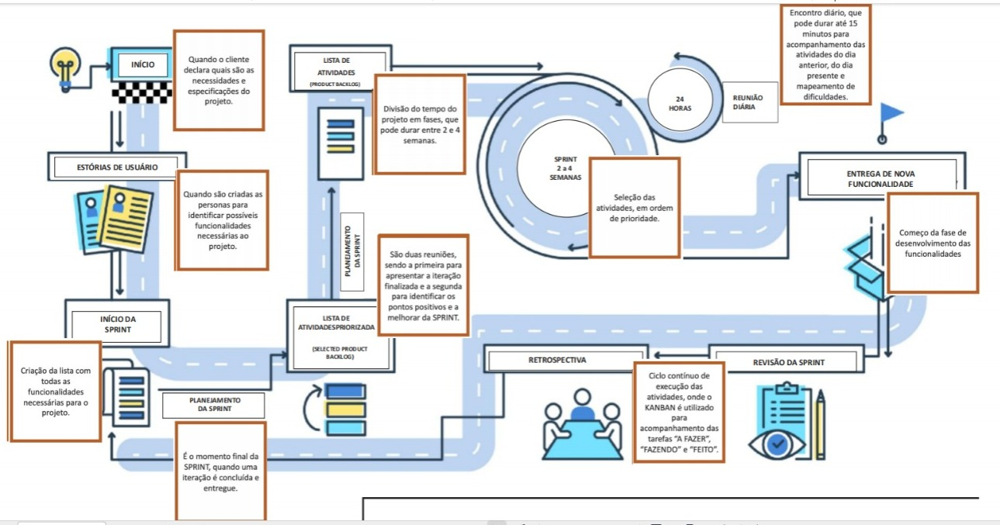

    Leanderson Lima:
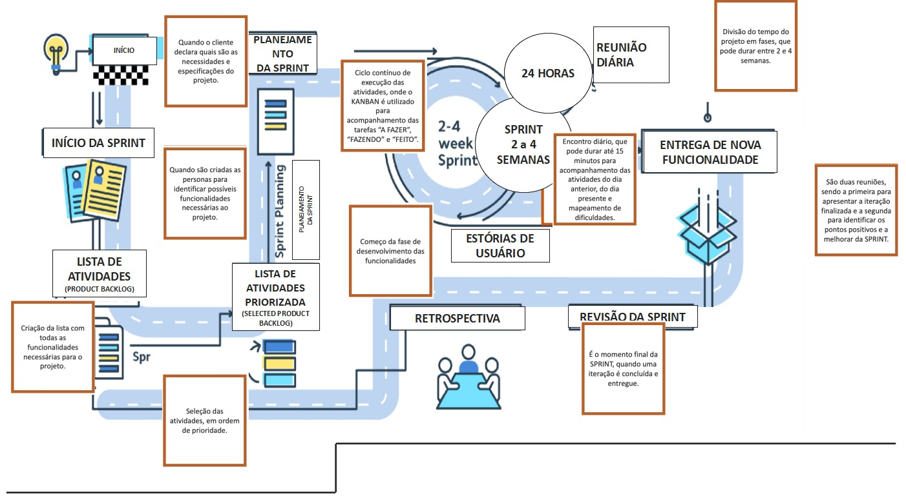

___

## LovePet / Bitrix

 

Essa atividade consistiu em exercitar os conceitos a respeito de projetos e metodologias usando a ferramenta Bitrix, conforme orientado na plataforma do Instituto JogaJunto criamos a LovePet.

### O Projeto LovePet 🐶🐱

Nos lançamos em uma jornada emocionante para dar vida ao aplicativo LovePet. 📱 Cada etapa do processo foi cuidadosamente estruturada, unindo pensamento estratégico com inovação. Esse projeto não apenas solidificou nossa compreensão das metodologias ágeis, mas também demonstrou nossa capacidade de contribuir efetivamente em um contexto de desenvolvimento prático e aplicado.

### Aventura Ágil do LovePet - Backlog e Sprints 🛤️🏃‍♀️

### Sprint 1 - Primeiros Passos 🐾🌊

**Backlog:**

| Descrição | Aplicação no Bitrix |
|----------|----------|
| - Desenvolver a funcionalidade de registro de usuário 📝 |  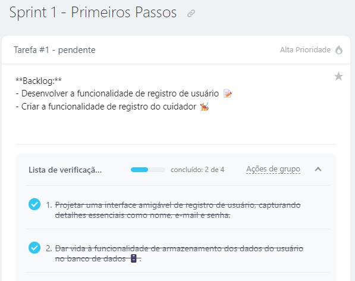  |
| - Criar a funcionalidade de registro do cuidador 🐕‍🦺 | 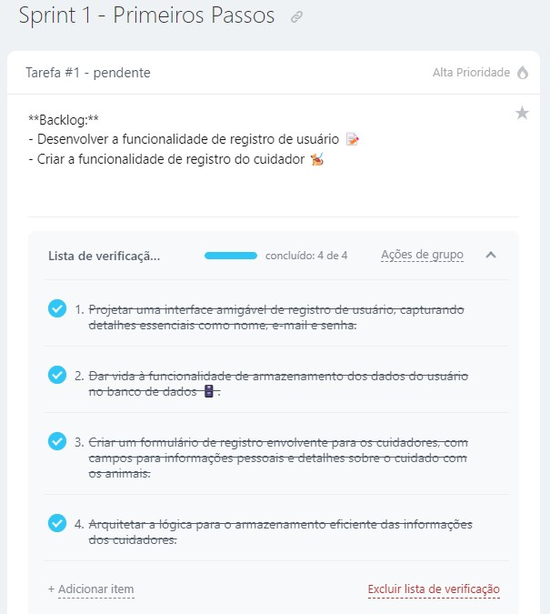  |
| - Observações sobre a tarefa 🧐 | 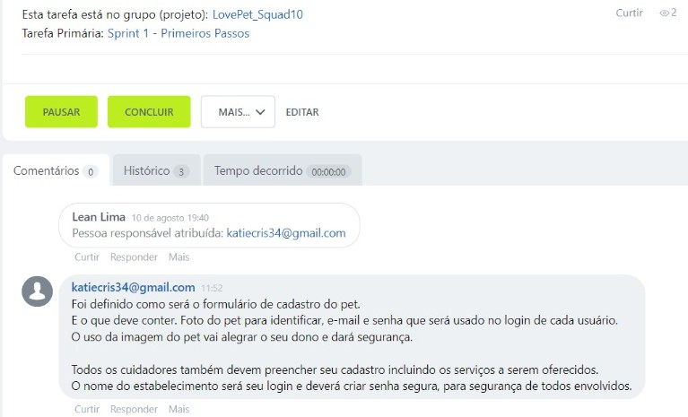  |

**Atividades:**
- Projetar uma interface amigável de registro de usuário, capturando detalhes essenciais como nome, e-mail e senha.
- Dar vida à funcionalidade de armazenamento dos dados do usuário no banco de dados 🗄️.
- Criar um formulário de registro envolvente para os cuidadores, com campos para informações pessoais e detalhes sobre o cuidado com os animais.
- Arquitetar a lógica para o armazenamento eficiente das informações dos cuidadores.

### Sprint 2 - Avaliações e Comentários 🌟📝

**Backlog:**

| Descrição | Aplicação no Bitrix |
|----------|----------|
| - Implementar um sistema de avaliação 📝 |  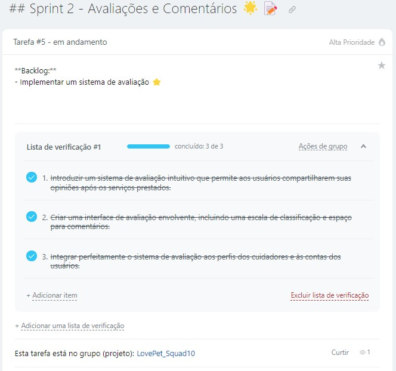  |
| - Observações sobre a tarefa 🧐 |  |

**Atividades:**
- Introduzir um sistema de avaliação intuitivo que permite aos usuários compartilharem suas opiniões após os serviços prestados.
- Criar uma interface de avaliação envolvente, incluindo uma escala de classificação e espaço para comentários.
- Integrar perfeitamente o sistema de avaliação aos perfis dos cuidadores e às contas dos usuários.

### Sprint 3 - Busca Pela Excelência 🐕‍🦺🔍

**Backlog:**

| Descrição | Aplicação no Bitrix |
|----------|----------|
|- Encontrar um cuidador ideal 🕵️‍♀️ |  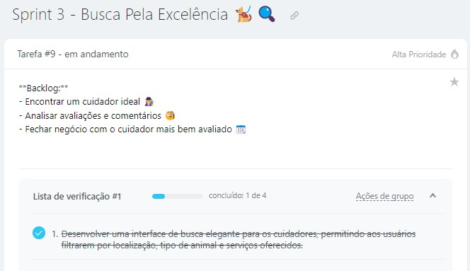  |
|- Analisar avaliações e comentários 🤔 | 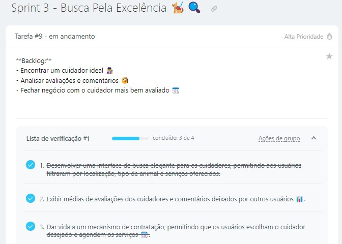 |
|- Fechar negócio com o cuidador mais bem avaliado 📆 | 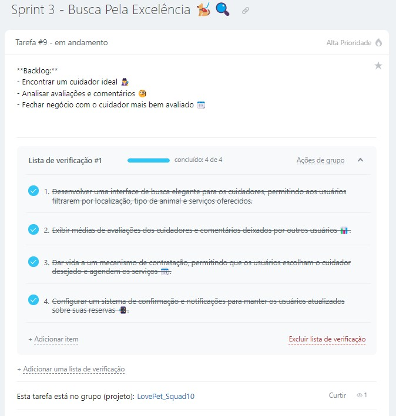 |
|- Observações sobre a tarefa 🧐 | 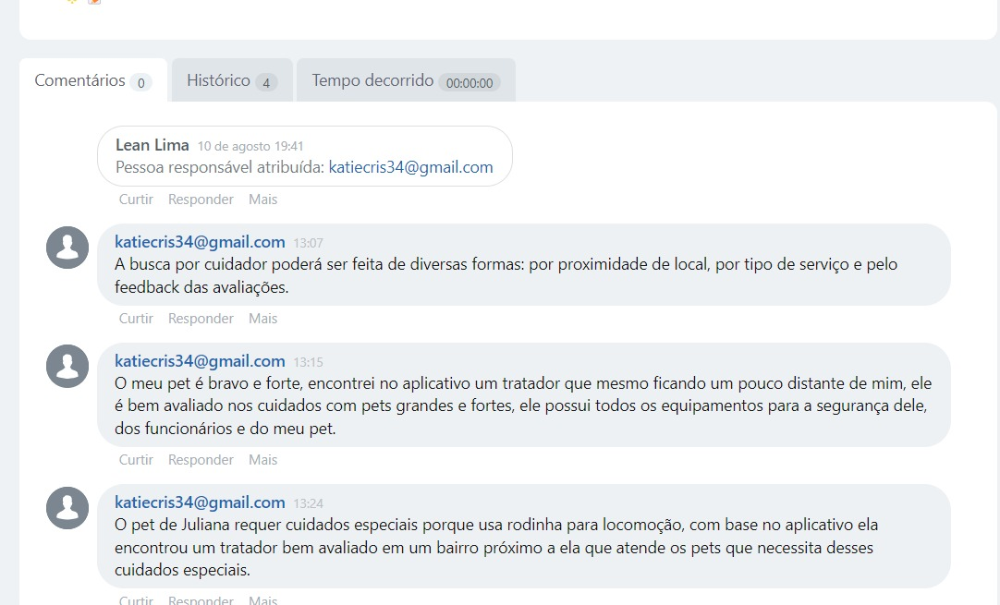 |

**Atividades:**
- Desenvolver uma interface de busca elegante para os cuidadores, permitindo aos usuários filtrarem por localização, tipo de animal e serviços oferecidos.
- Exibir médias de avaliações dos cuidadores e comentários deixados por outros usuários 📊.
- Dar vida a um mecanismo de contratação, permitindo que os usuários escolham o cuidador desejado e agendem os serviços 🗓️.
- Configurar um sistema de confirmação e notificações para manter os usuários atualizados sobre suas reservas 📲.

### Notas Adicionais 📌

| Descrição | Aplicação no Bitrix |
|----------|----------|
|- Cada sprint conclui com testes minuciosos de usabilidade e correção de eventuais bugs 🐞, criamos então uma tarefa exclusiva para realização de testes unitários. |  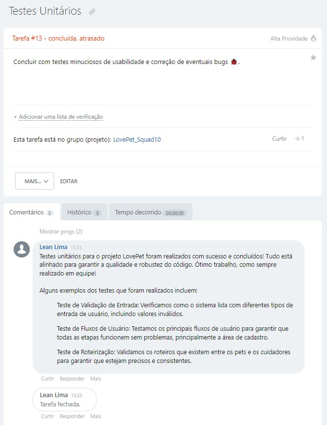  |
|- Ficamos atentos a possíveis aprimoramentos de segurança, como verificações de antecedentes para os cuidadores 🔐, criamos então uma tarefa exclusiva para verificação de um requisito específico de segurança. |  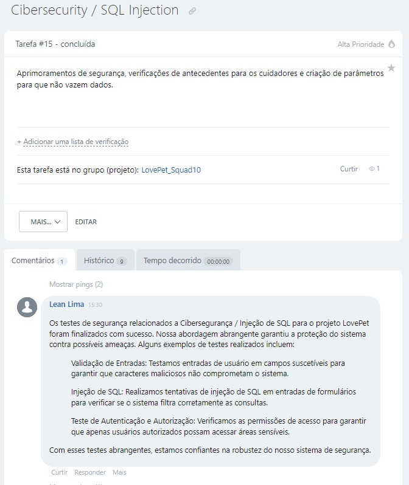  |
|- Comprometemo-nos a manter uma interface de aplicativo intuitiva e amigável, cativando e retendo nossos usuários! 💖  | 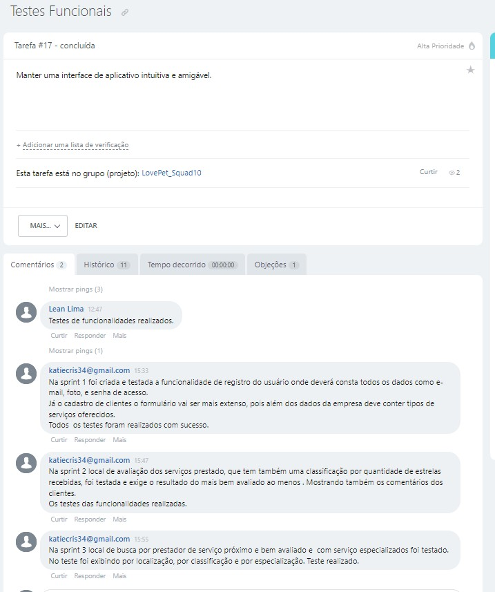  |
|- Nosso plano foi fazer um projeto dinâmico, sujeita a ajustes com base nas necessidades do projeto. Para facilicar a organização e realização das tarefas utilizamos o quadro Kanban disponível na plataforma. | 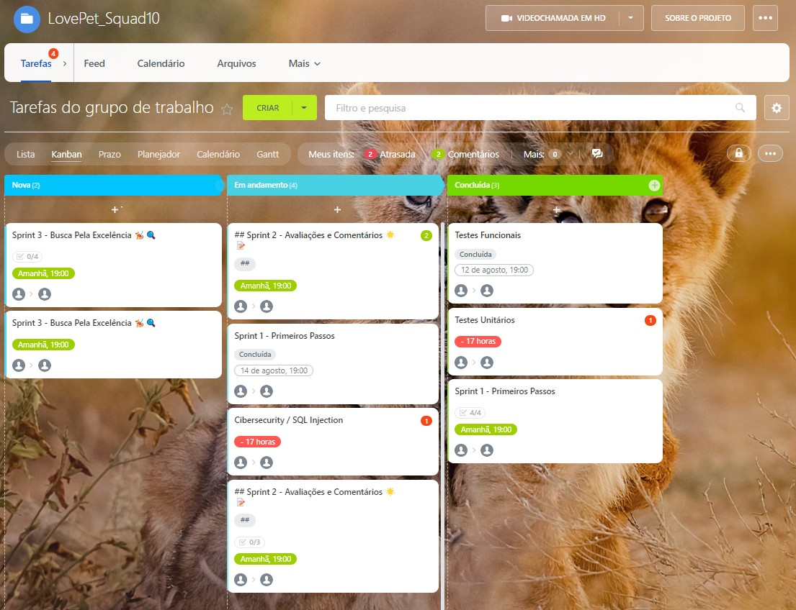 |

O resultado foi a realização de todas as tarefas:

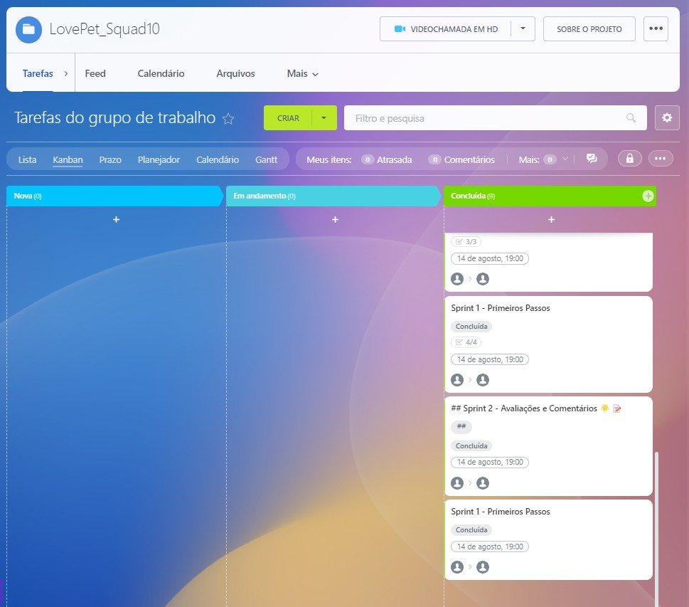
___

Obs: Esse projeto está no em meu portifólio, acesse https://github.com/LeanDevLima/Squad10_M2.
