# Squad10 - Gestão de Projetos🚀

Neste espaço, você encontrará uma coleção valiosa de atividades realizadas durante o Módulo 2 do curso de Quality Assurance oferecido pelo [**Instituto JogaJunto**](https://www.jogajuntoinstituto.org/). Sinta-se à vontade para explorar cada atividade, uma vez que todas foram minuciosamente planejadas e executadas de maneira colaborativa em grupo.

Clique nas "►" abaixo para visualizar os conteúdos trabalhados nesse módulo. Para recolher o conteúdo, basta clicar nas "▼" novamente.  😁

___

 Módulo 2 Aula 1 - Pesquisas

___

🚀 Desvendando os Benefícios da Gestão de Projetos 🌟

 
O propósito dessa atividade era pesquisar os benefícios de uma boa gestão de projetos e dentre estes mesmos benefícios escolher apenas dois e juntificar o motivo dessa escolha. 

## Benefícios Destacados 🌈

📆 **Entrega no Prazo e Orçamento:** Garante prazos realistas, alocação eficiente de recursos e monitoramento contínuo. Minimiza atrasos e estouros no orçamento, garantindo entregas dentro das limitações de tempo e custo.

🎯 **Alinhamento com Objetivos Estratégicos:** Garante que os projetos estejam em sintonia com a visão estratégica da organização. Evita alocação de recursos em iniciativas que não contribuem para os objetivos maiores da empresa.

🔍 **Melhoria na Tomada de Decisões:** Fornece informações atualizadas, permitindo decisões informadas e oportunas. Antecipa problemas e permite a implementação de medidas corretivas antes que se tornem obstáculos significativos.

📊 **Alocação Eficiente de Recursos:** Permite otimizar recursos como tempo, dinheiro, mão de obra e materiais. Evita desperdícios e subutilização, maximizando a produtividade global.

📢 **Comunicação Aprimorada:** Facilita a comunicação entre equipes, partes interessadas e tomadores de decisão. Reduz mal-entendidos, conflitos e lacunas de informação, melhorando a colaboração e a coesão.

⚠️ **Identificação e Mitigação de Riscos:** Inclui a identificação proativa de riscos potenciais. Isso possibilita a adoção de medidas para minimizar riscos ou criar planos de contingência, reduzindo os impactos negativos.

🏆 **Maior Qualidade do Resultado Final:** Através de planejamento adequado e controle de qualidade, assegura que o resultado final atenda aos padrões requeridos e às expectativas dos stakeholders.

🔄 **Melhoria na Gestão de Mudanças:** Ajuda a facilitar transições suaves durante mudanças. Minimiza resistências e interrupções nos processos organizacionais.

⚙️ **Melhoria na Eficiência Operacional:** Otimiza os processos envolvidos no projeto, contribuindo para uma eficiência operacional geral mais elevada da organização.

🧠 **Aprendizado e Melhoria Contínua:** Após a conclusão do projeto, permite uma análise retrospectiva para identificar pontos fortes e fracos. Isso possibilita aprendizado e aprimoramento contínuo dos processos de gestão de projetos.

## Destaques: Benefícios Significativos 🌟🌟

Dois benefícios que se destacam como os mais importantes são:

📆 **Entrega no Prazo e Orçamento:** Crucial para evitar consequências financeiras negativas, insatisfação dos stakeholders e preservação da credibilidade da organização.

🎯 **Alinhamento com Objetivos Estratégicos:** Fundamenta-se na alocação inteligente de recursos para projetos que genuinamente impulsionam o valor da organização e sua visão de longo prazo.

Essas escolhas são baseadas na importância de cumprir prazos e orçamentos, bem como na necessidade de garantir que os esforços estejam alinhados com a direção estratégica para máximo impacto positivo. 👥

___

🚀 Desvendando as Metodologias Ágeis 🌟

 
O propósito dessa atividade era pesquisar os tipos de metodologias ágeis e dentre estas mesmas metodologias escolher apenas dois e juntificar o motivo dessa escolha.

## Metodologias Ágeis e Suas Descrições

1. **Scrum:** Scrum é uma metodologia ágil que divide o processo de desenvolvimento em iterações chamadas de "sprints" 🏃‍♂️. Cada sprint tem uma duração fixa e resulta em um incremento funcional do software. A equipe se reúne regularmente para revisar o progresso e planejar o próximo sprint.

2. **Kanban:** Kanban é mais um método visual de gestão do trabalho do que uma metodologia estrita 📋. Ele usa quadros para representar tarefas e seus estados, permitindo que a equipe visualize o fluxo de trabalho e limite o trabalho em progresso para melhorar a eficiência.

3. **Extreme Programming (XP):** XP enfatiza a qualidade do código e a colaboração contínua 🚀. Ele envolve práticas como desenvolvimento orientado a testes (TDD), integração contínua e releases frequentes para entregar valor mais rapidamente.

4. **Lean Development:** Baseado no Lean Manufacturing, essa abordagem visa eliminar desperdícios e focar na entrega de valor ao cliente ♻️. Ele enfatiza a eficiência do fluxo de trabalho e a melhoria contínua.

5. **Crystal:** Crystal é adaptável às necessidades e características da equipe e do projeto 💎. Ele possui diferentes "cores" que podem ser escolhidas com base na criticidade do projeto, riscos e tamanho da equipe.

6. **Dynamic Systems Development Method (DSDM):** DSDM combina princípios de gerenciamento de projetos ágeis com metodologias iterativas e incrementais, focando na entrega pontual e no alinhamento com os objetivos de negócios 🔄.

7. **Feature-Driven Development (FDD):** FDD se concentra na entrega de recursos (features) funcionais de forma incremental 🎯. Ele divide o processo de desenvolvimento em etapas específicas, como modelagem de domínio, design de features e construção.

## Melhores Metodologias para Desenvolvimento de Software

Dentre as metodologias citadas, conforme solicitado na atividade, o grupo considerou essas duas metodolodias mais eficientes no caso do desenvolvimento de um software.

1. **Scrum:** Scrum é uma das metodologias ágeis mais amplamente adotadas e é bem adequada para projetos de desenvolvimento de software, incluindo aplicativos mobile e web 📱🌐. Sua estrutura de sprints, reuniões regulares e foco na entrega de incrementos funcionais se alinham bem com o ritmo e as necessidades de desenvolvimento de software moderno.

2. **Extreme Programming (XP):** XP é uma excelente escolha quando a qualidade do código e a colaboração são fundamentais 💻🤝. Isso é particularmente relevante para aplicativos mobile e web, onde a experiência do usuário e a funcionalidade são cruciais. Práticas como desenvolvimento orientado a testes (TDD) e integração contínua podem ajudar a manter a qualidade e a agilidade durante todo o ciclo de desenvolvimento.

Ambas as metodologias oferecem estruturas sólidas e práticas específicas para lidar com os desafios do desenvolvimento de software, ao mesmo tempo que enfatizam a entrega de valor e a adaptabilidade. A escolha entre elas dependerá das preferências da equipe, da natureza do projeto e das necessidades do cliente. 🤔🚀

## Bônus: Lean Six Sigma

O Lean Six Sigma é uma abordagem que combina os princípios do Lean Manufacturing e a metodologia Six Sigma. Ela visa melhorar a eficiência, eliminar defeitos e otimizar processos. Enquanto o Lean se concentra na redução de desperdícios, o Six Sigma visa reduzir variações e garantir qualidade. É amplamente utilizado em diversos setores para alcançar a excelência operacional e aprimorar a entrega de produtos e serviços.

___

Módulo 2 Aula 2 - Atividades Práticas 

___

Quebra-Cabeça

Essa atividade consistiu em montar um quebra-cabeça referente a organização coreta de como aplicar metodologia ágil em um projeto. Portanto recebemos o quebra cabeça da seguinte forma: 

Cada integrante do grupo montou o quebra cabeça à sua maneira e obtemos os seguintes resultados:

    Katie Lima:

    Leanderson Lima:

___

LovePet / Bitrix

 

Essa atividade consistiu em exercitar os conceitos a respeito de projetos e metodologias usando a ferramenta Bitrix, conforme orientado na plataforma do Instituto JogaJunto criamos a LovePet.

## O Projeto LovePet 🐶🐱

Nos lançamos em uma jornada emocionante para dar vida ao aplicativo LovePet. 📱 Cada etapa do processo foi cuidadosamente estruturada, unindo pensamento estratégico com inovação. Esse projeto não apenas solidificou nossa compreensão das metodologias ágeis, mas também demonstrou nossa capacidade de contribuir efetivamente em um contexto de desenvolvimento prático e aplicado.

## Aventura Ágil do LovePet - Backlog e Sprints 🛤️🏃‍♀️

## Sprint 1 - Primeiros Passos 🐾🌊

**Backlog:**

| Descrição | Aplicação no Bitrix |
|----------|----------|
| - Desenvolver a funcionalidade de registro de usuário 📝 |    |
| - Criar a funcionalidade de registro do cuidador 🐕‍🦺 |   |
| - Observações sobre a tarefa 🧐 |   |

**Atividades:**
- Projetar uma interface amigável de registro de usuário, capturando detalhes essenciais como nome, e-mail e senha.
- Dar vida à funcionalidade de armazenamento dos dados do usuário no banco de dados 🗄️.
- Criar um formulário de registro envolvente para os cuidadores, com campos para informações pessoais e detalhes sobre o cuidado com os animais.
- Arquitetar a lógica para o armazenamento eficiente das informações dos cuidadores.

## Sprint 2 - Avaliações e Comentários 🌟📝

**Backlog:**

| Descrição | Aplicação no Bitrix |
|----------|----------|
| - Implementar um sistema de avaliação 📝 |    |
| - Observações sobre a tarefa 🧐 |  |

**Atividades:**
- Introduzir um sistema de avaliação intuitivo que permite aos usuários compartilharem suas opiniões após os serviços prestados.
- Criar uma interface de avaliação envolvente, incluindo uma escala de classificação e espaço para comentários.
- Integrar perfeitamente o sistema de avaliação aos perfis dos cuidadores e às contas dos usuários.

## Sprint 3 - Busca Pela Excelência 🐕‍🦺🔍

**Backlog:**

| Descrição | Aplicação no Bitrix |
|----------|----------|
|- Encontrar um cuidador ideal 🕵️‍♀️ |    |
|- Analisar avaliações e comentários 🤔 |  |
|- Fechar negócio com o cuidador mais bem avaliado 📆 |  |
|- Observações sobre a tarefa 🧐 |  |

**Atividades:**
- Desenvolver uma interface de busca elegante para os cuidadores, permitindo aos usuários filtrarem por localização, tipo de animal e serviços oferecidos.
- Exibir médias de avaliações dos cuidadores e comentários deixados por outros usuários 📊.
- Dar vida a um mecanismo de contratação, permitindo que os usuários escolham o cuidador desejado e agendem os serviços 🗓️.
- Configurar um sistema de confirmação e notificações para manter os usuários atualizados sobre suas reservas 📲.

## Notas Adicionais 📌

| Descrição | Aplicação no Bitrix |
|----------|----------|
|- Cada sprint conclui com testes minuciosos de usabilidade e correção de eventuais bugs 🐞, criamos então uma tarefa exclusiva para realização de testes unitários. |    |
|- Ficamos atentos a possíveis aprimoramentos de segurança, como verificações de antecedentes para os cuidadores 🔐, criamos então uma tarefa exclusiva para verificação de um requisito específico de segurança. |    |
|- Comprometemo-nos a manter uma interface de aplicativo intuitiva e amigável, cativando e retendo nossos usuários! 💖  |   |
|- Nosso plano foi fazer um projeto dinâmico, sujeita a ajustes com base nas necessidades do projeto. Para facilicar a organização e realização das tarefas utilizamos o quadro Kanban disponível na plataforma. |  |

O resultado foi a realização de todas as tarefas:

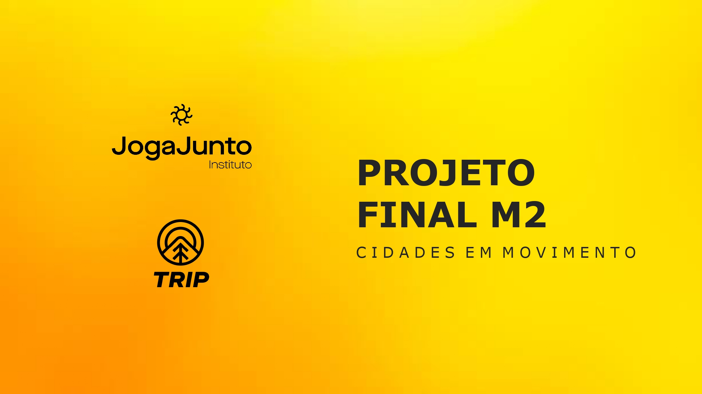

___

Módulo 2 Aula 3 - Projeto Final

 

🚀 O projeto final consistiu no preenchimento e apresentação do PDF incorporado neste repositório! Nosso objetivo é proporcionar uma experiência visual incrível. Confira as imagens para uma visualização mais fácil. 👀📄

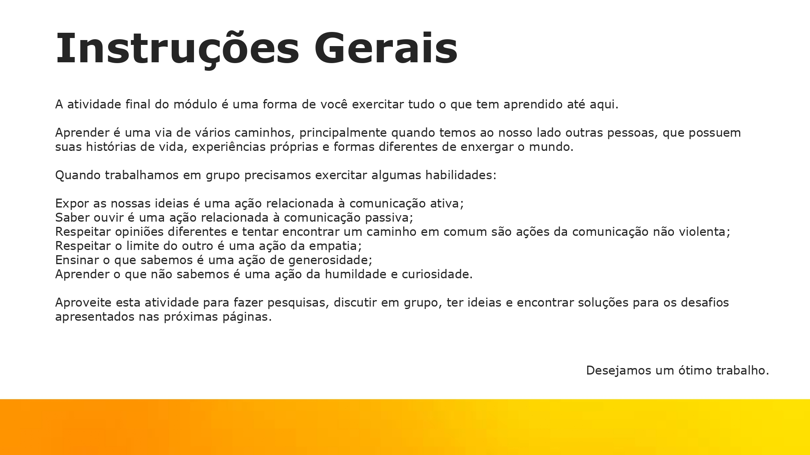
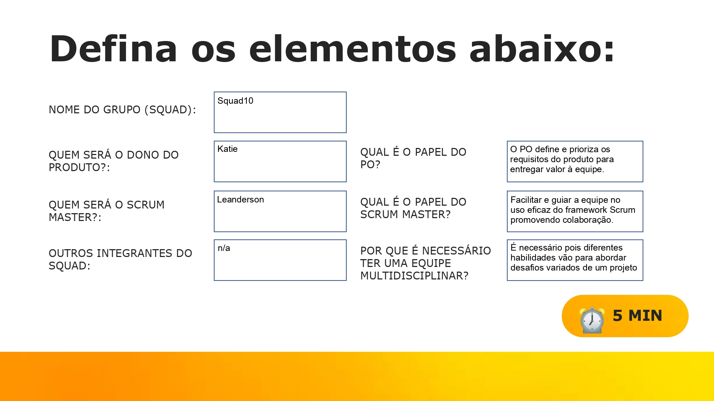
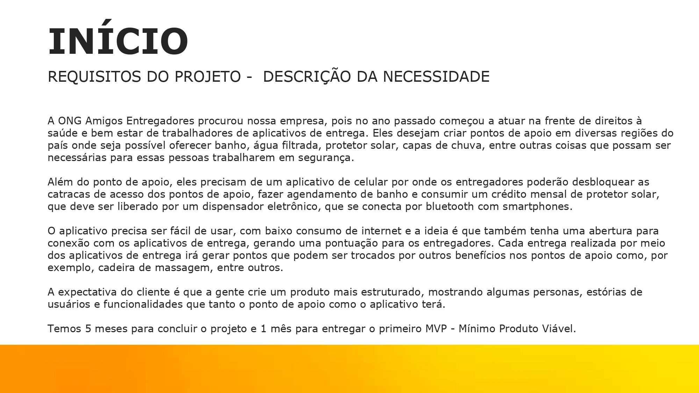
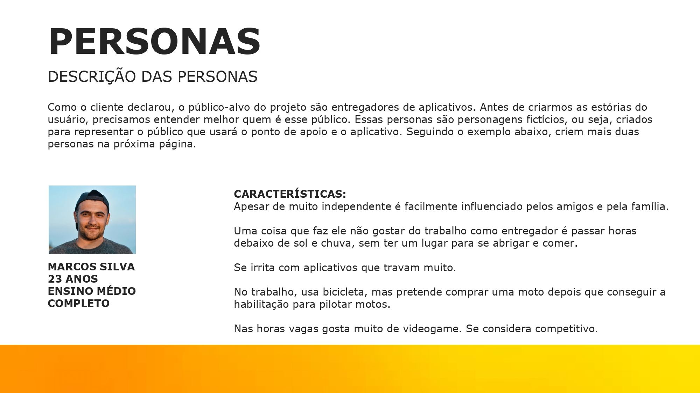
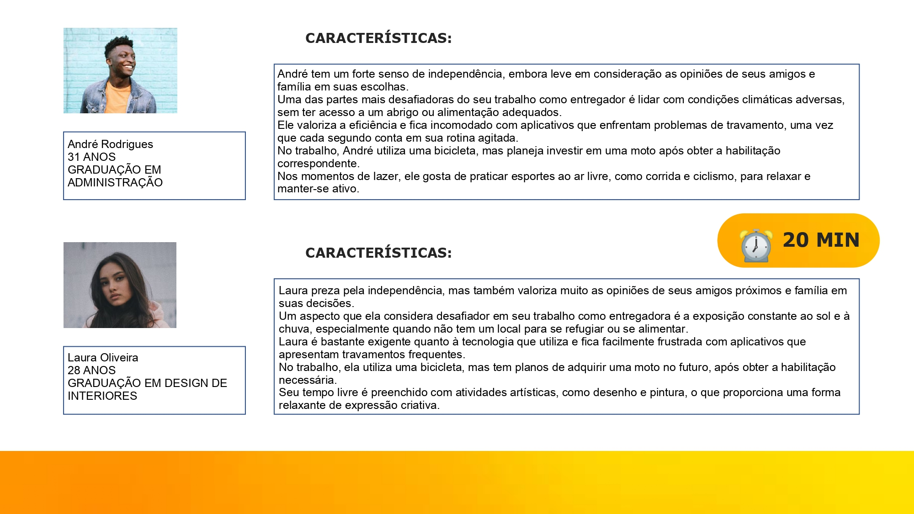
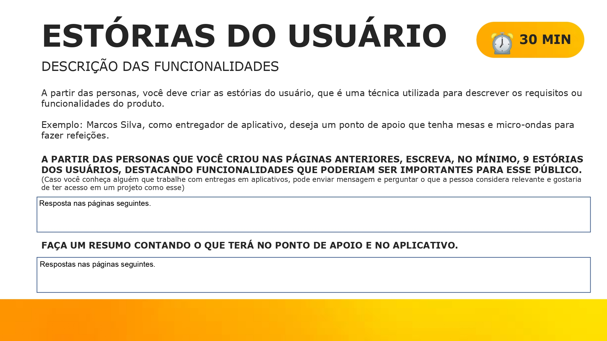
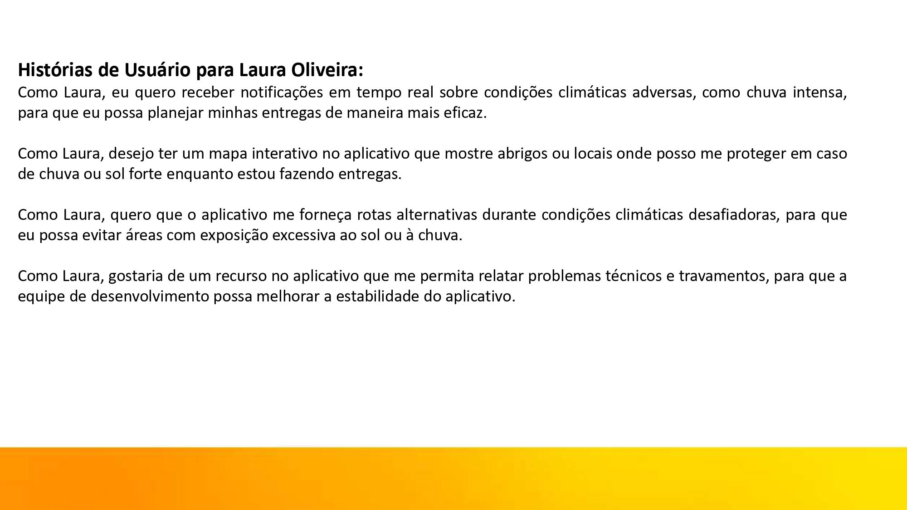
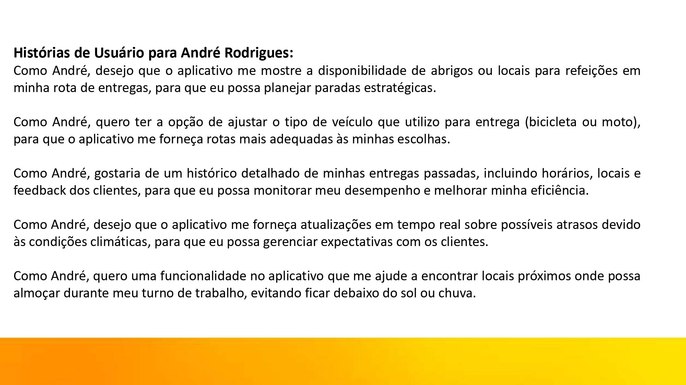
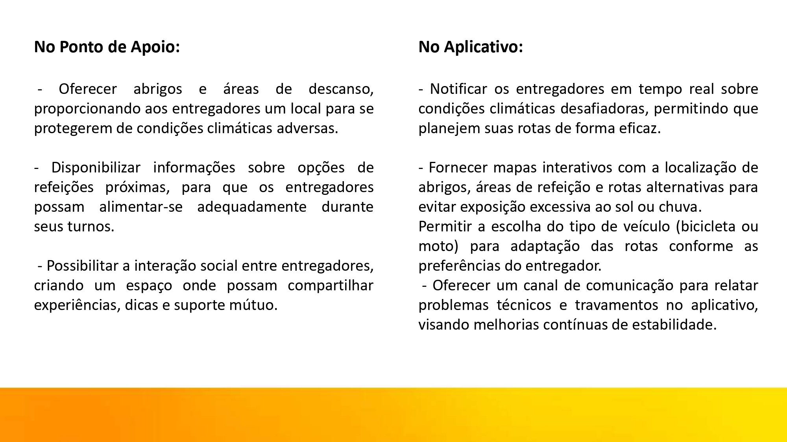
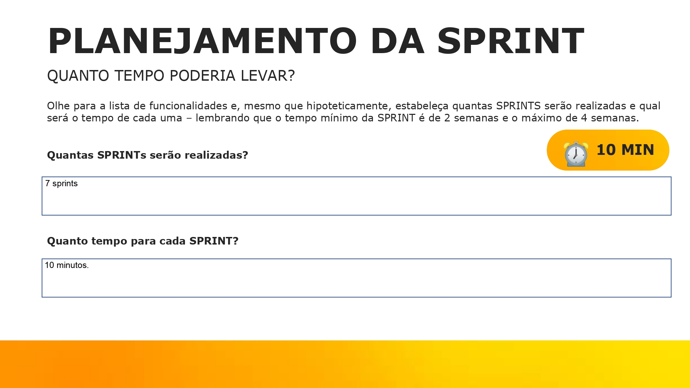
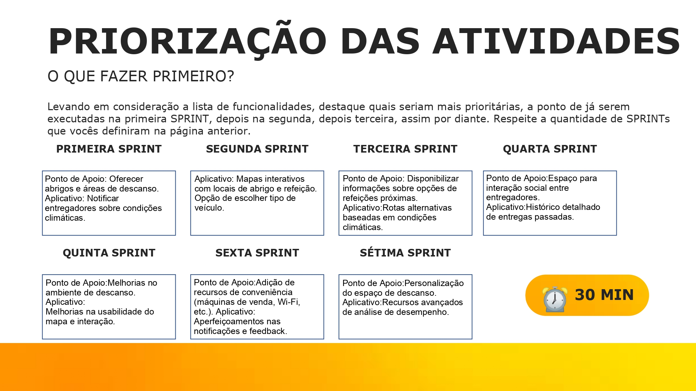
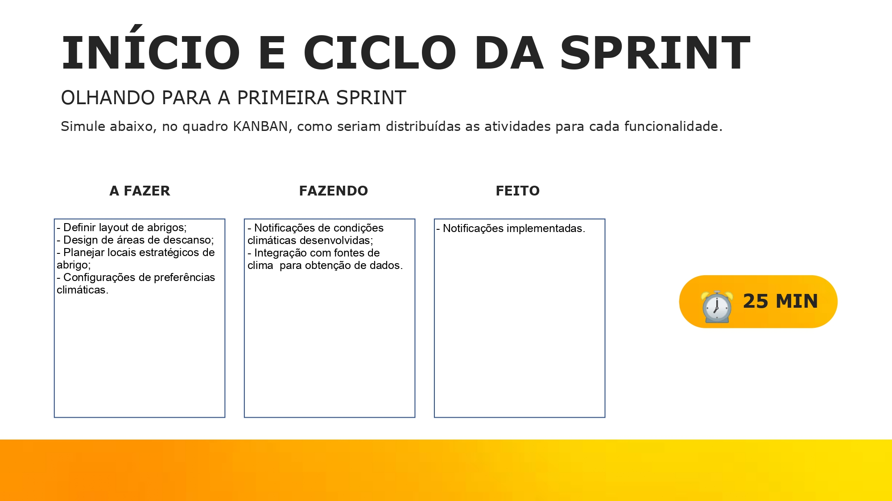
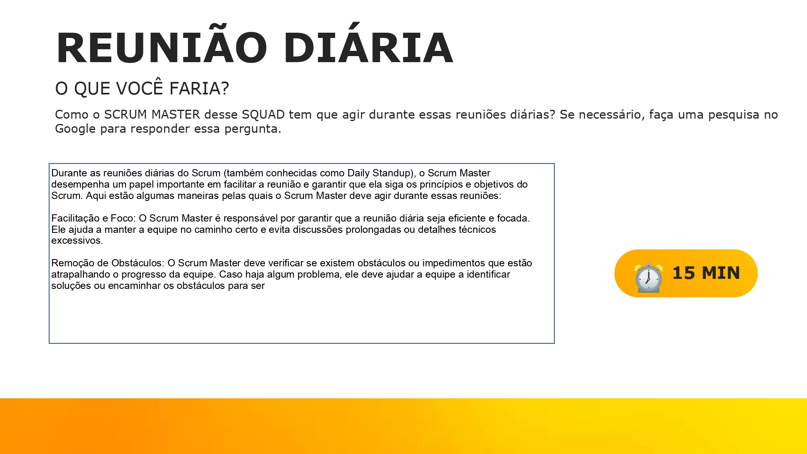
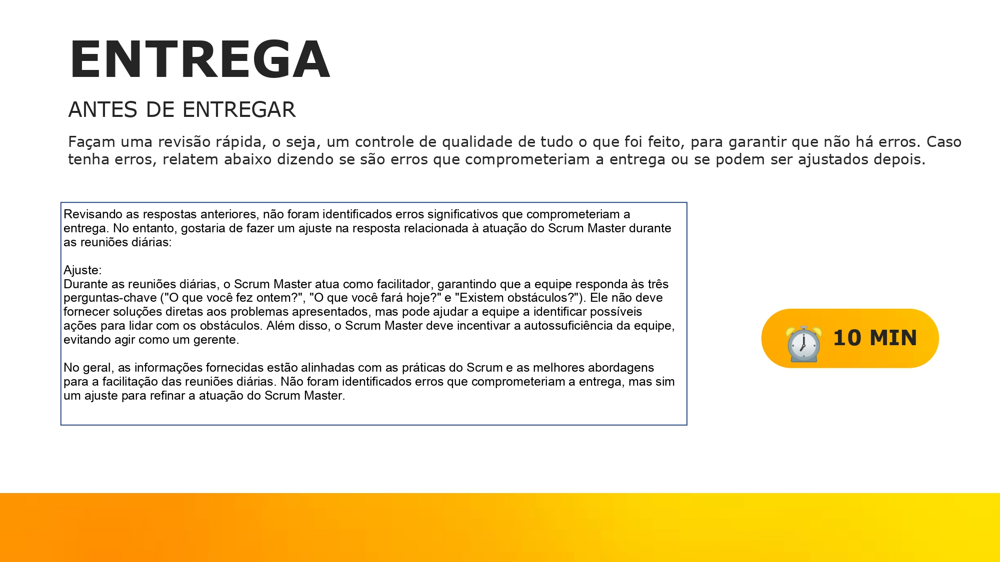
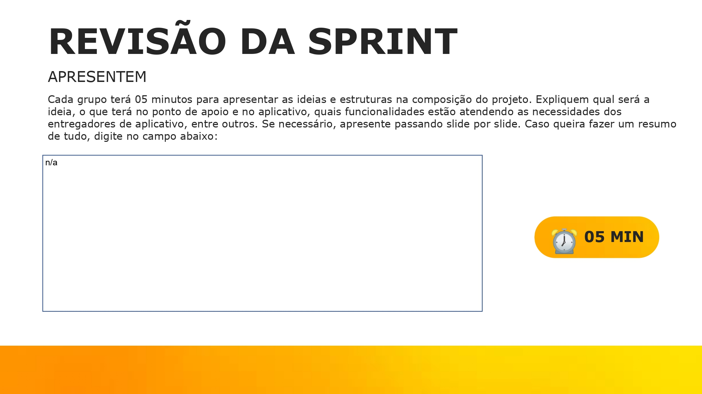
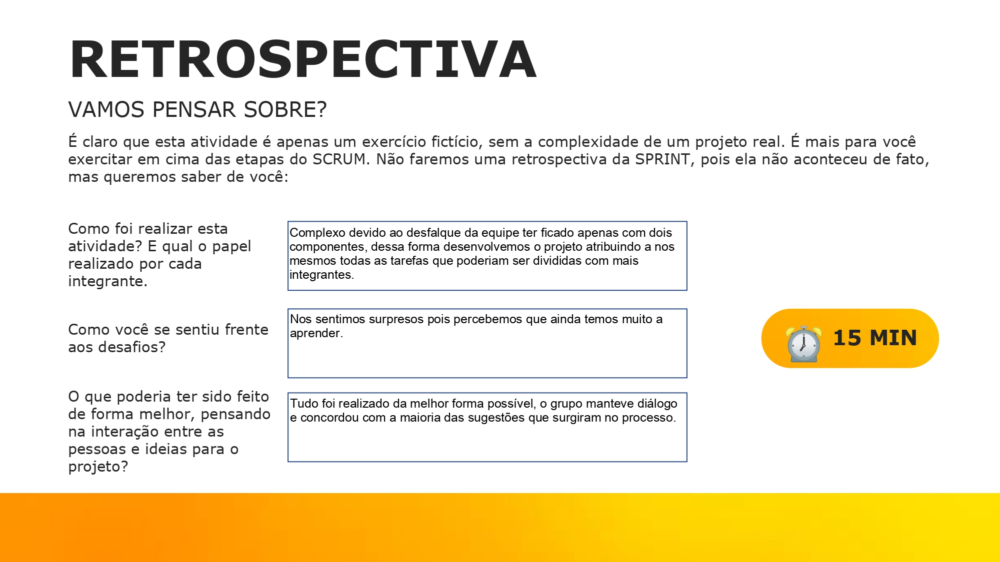
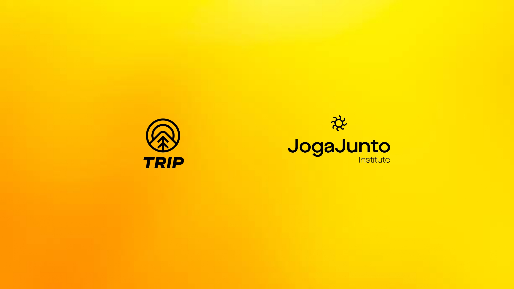

___

## Integrantes do grupo 📌

[Leanderson Lima](https://www.linkedin.com/in/leanderson-dias-de-lima/) 👨🏾‍💻

[Katie Lima](https://www.linkedin.com/in/katie-lima1/) 👩🏻‍💻

